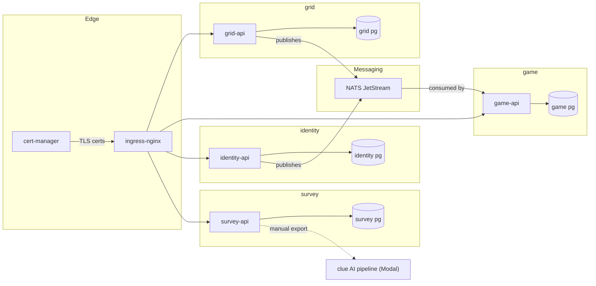
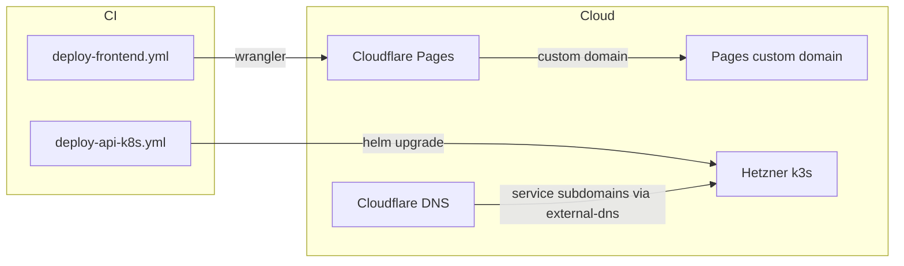
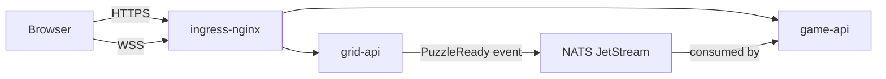
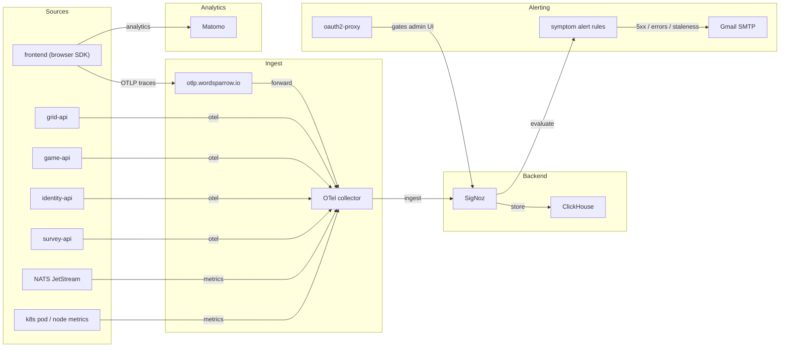
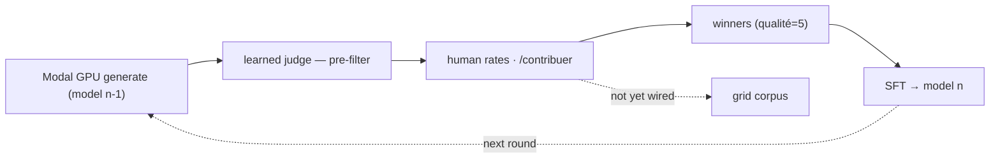

# WordSparrow

[](https://github.com/Ishou/wordsparrow/actions/workflows/ci.yml)
[](https://github.com/Ishou/wordsparrow/actions/workflows/codeql.yml)
[](https://github.com/Ishou/wordsparrow/actions/workflows/deploy-frontend.yml)
[](https://github.com/Ishou/wordsparrow/actions/workflows/deploy-api-k8s.yml)
[](https://github.com/Ishou/wordsparrow/actions/workflows/lighthouse.yml)
[](./LICENSE)

A *mots fléchés* (French crossword variant) puzzle game for web, tablet,
and mobile, with future Discord-Activity support. Brand identity is
recorded in [ADR-0005](./docs/adr/0005-brand-identity.md); "Bliss" is
the working codename used throughout the repo.

Live: <https://wordsparrow.io>

## Status

Sandbox / pre-alpha. Daily puzzles generate and play end-to-end; the
multiplayer game context and player identity (OIDC) are in active
development. Operated by a single maintainer with a fleet of AI agents
working in parallel ([ADR-0001](./docs/adr/0001-parallel-agent-development-workflow.md)).

## Application architecture

Bounded contexts, each hexagonally layered
(`domain/` → `application/` → `infrastructure/` → `api/`):

- **`grid/`** — Kotlin/JVM. Puzzle generation, validation, word
  corpus. Includes a daily pre-generation worker
  ([ADR-0042](./docs/adr/0042-daily-puzzle-pre-generation-worker.md))
  and the bitmask-CSP grid generator
  ([ADR-0039](./docs/adr/0039-bitmask-csp-grid-generator.md)).
- **`game/`** — Kotlin/JVM. Multiplayer lobbies and realtime play
  over REST + WebSocket
  ([ADR-0018](./docs/adr/0018-game-bounded-context-and-realtime.md)).
- **`identity/`** — Kotlin/JVM. Player OIDC and session tokens
  ([ADR-0044](./docs/adr/0044-identity-bounded-context-for-player-oidc.md),
  [ADR-0047](./docs/adr/0047-token-endpoint-exchange-threat-model.md)).
- **`frontend/`** — Vite + React 19 + TypeScript + Panda CSS +
  TanStack Router. Player UI, deployed as a static bundle to
  Cloudflare Pages ([ADR-0002](./docs/adr/0002-frontend-stack.md)).

JVM is Kotlin 2.x on JDK 21 with Ktor for HTTP/WS
([ADR-0006](./docs/adr/0006-jvm-http-framework.md)) and Postgres via
CNPG + Flyway. Cross-context imports are forbidden; communication is
schema-first via OpenAPI for HTTP and AsyncAPI 2.6 for WebSocket
([ADR-0003](./docs/adr/0003-cross-language-api-contract.md),
[ADR-0019](./docs/adr/0019-asyncapi-2.6-not-3.x.md)), with cross-context
events flowing over NATS JetStream
([ADR-0049](./docs/adr/0049-nats-jetstream-cross-context-events.md)).
Generated TypeScript types are checked in and gated by drift CI.

## Infrastructure (IaC)

All infrastructure is declarative and version-controlled. Nothing is
clicked in a console.

<!-- INFRA-DIAGRAM:cluster START -->

<p align="center"><sub><b>Figure 1.</b> In-cluster topology grouped by bounded context — each box is one context's API and database. Dashed edges are manual or leave the cluster.</sub></p>
<!-- INFRA-DIAGRAM:cluster END -->

<!-- INFRA-DIAGRAM:cloud START -->

<p align="center"><sub><b>Figure 2.</b> Where the frontend and cluster are hosted, and the CI workflows that deploy them.</sub></p>
<!-- INFRA-DIAGRAM:cloud END -->

<!-- INFRA-DIAGRAM:flow START -->

<p align="center"><sub><b>Figure 3.</b> How a request and the daily-puzzle event move through the system at runtime.</sub></p>
<!-- INFRA-DIAGRAM:flow END -->

- **Cloud + DNS** — OpenTofu manages a self-hosted Hetzner k3s cluster
  ([ADR-0009](./docs/adr/0009-self-managed-k8s-deployment.md),
  [ADR-0011](./docs/adr/0011-opentofu-for-k8s-subtree.md)), Cloudflare
  DNS records, and the Cloudflare Pages project for the frontend
  ([ADR-0004](./docs/adr/0004-hello-world-deployment.md)). Roots in
  [`terraform/`](./terraform/) (Cloudflare) and
  [`terraform/k8s/`](./terraform/k8s/) (provider-agnostic cluster
  module). State is remote
  ([ADR-0010](./docs/adr/0010-terraform-remote-state-hetzner.md));
  versions are pinned via `versions.tf` and `.terraform.lock.hcl`.
- **Cluster apps** — every in-cluster app ships as a Helm chart under
  [`infra/`](./infra/):
  [`infra/platform/`](./infra/platform/) (ingress-nginx, cert-manager,
  ClusterIssuers), [`infra/observability/`](./infra/observability/)
  (SigNoz + alerts + oauth2-proxy),
  [`infra/nats/`](./infra/nats/) (JetStream streams bootstrapped via
  in-cluster Job), [`infra/matomo/`](./infra/matomo/) (RGPD-compliant
  product analytics, [ADR-0025](./docs/adr/0025-product-analytics-matomo-rgpd.md)).
  App charts and Postgres CNPG clusters live alongside each bounded
  context.
- **Configure-in-cluster, not push-from-CI** — when an app needs config
  bootstrapped (alert rules, JetStream streams, feature-flag seeds), it
  ships as a Helm `post-install,post-upgrade` Job inside the chart
  rather than `kubectl port-forward` from a GitHub Action.
- **Deploy pipelines** — frontend via
  [`.github/workflows/deploy-frontend.yml`](./.github/workflows/deploy-frontend.yml)
  to Cloudflare Pages; APIs + workers via
  [`.github/workflows/deploy-api-k8s.yml`](./.github/workflows/deploy-api-k8s.yml)
  using `helm upgrade --install`. Container images are pinned by digest.

Operational guides: [`docs/local-development.md`](./docs/local-development.md),
[`docs/deploy.md`](./docs/deploy.md), [`docs/secrets.md`](./docs/secrets.md).

## Observability, alerting & analytics

OpenTelemetry from day 1, both ends of the stack. The diagram below is the
**target** topology — telemetry and symptom alerts on *every* module (plus the
RGPD-compliant Matomo analytics path). A module without a source edge here is a
gap to address, not a documented exception.

<!-- INFRA-DIAGRAM:observability START -->

<p align="center"><sub><b>Figure 4.</b> Target telemetry, alerting and analytics topology — a module without a source edge here is a gap to address, not an exception.</sub></p>
<!-- INFRA-DIAGRAM:observability END -->

- **Frontend traces** ship to a public OTLP ingest fronted by ingress
  ([ADR-0033](./docs/adr/0033-frontend-otel-public-ingest.md)).
- **Backend telemetry** lands in **SigNoz on ClickHouse**
  ([ADR-0027](./docs/adr/0027-observability-backend-signoz.md),
  [ADR-0041](./docs/adr/0041-clickhouse-keeper-migration.md)), with a
  dedicated worker topology to isolate the observability data plane
  ([ADR-0040](./docs/adr/0040-observability-dedicated-worker-topology.md)).
  Cluster + node metrics flow via the k8s infra collector
  ([ADR-0038](./docs/adr/0038-k8s-infra-pod-node-metrics.md)).
- **Logs are structured JSON** with correlation IDs. No `println`, no
  `console.log`, no string concatenation in log messages.
- **Alerts target symptoms, not causes** — API 5xx rate, frontend error
  rate, daily-puzzle staleness. Alert rules are markdown files in
  [`infra/observability/alerts/`](./infra/observability/alerts/) and
  applied via an in-cluster Helm Job; routing is Gmail SMTP
  ([ADR-0032](./docs/adr/0032-symptom-alerting-api-5xx-via-gmail-smtp.md)).
  The admin UI is gated by oauth2-proxy
  ([ADR-0030](./docs/adr/0030-oauth2-proxy-session-cookie.md)).

## Clue generation pipeline

French crossword clues need a French model that respects domain rules
(no stem leak, right register, exact length, valid morphology).
Off-the-shelf APIs don't clear that bar, so the project trains its own
French clue model on Modal GPU
([ADR-0057](./docs/adr/0057-cloud-gpu-modal-finetune-lane.md)) through
human-in-the-loop rounds. The lane lives in
[`scripts/clue_generation/pipeline_v2/`](./scripts/clue_generation/pipeline_v2/).

<!-- INFRA-DIAGRAM:clue-pipeline START -->

<p align="center"><sub><b>Figure 5.</b> The Modal clue-generation training loop. Dashed edges are the round restart and the not-yet-wired grid corpus.</sub></p>
<!-- INFRA-DIAGRAM:clue-pipeline END -->

- **Generator** — successive fine-tuned model iterations on Modal GPU;
  each round's model generates candidate clues for the sampled lemmas.
- **Structural filters** — a deterministic chain in `pipeline_v2` gates
  candidates before human review: typography, length, French-language
  detection (lingua), self-reference, tautology, stem-leak, and pleonasm.
- **Judge** — a learned judge (`filter_8`) scores semantic quality as a
  pre-filter ahead of human rating (currently shadow-scored). The human
  rater on `/contribuer` is the reward signal — never the judge — so the
  generator cannot reward-hack it.
- **Rounds** — maintainer-rated winners (`qualité=5`) become the SFT
  training set for the next model iteration; the loop stays human-anchored.
- **Grid corpus** — not yet fed from this lane. The in-cluster
  `words-clues-worker` ingestion
  ([ADR-0013](./docs/adr/0013-words-clues-worker.md)) hasn't been rewired
  from the old CSV path to the Modal pipeline.

The human stays the reward by design: the judge only triages obvious-bad
to cut rating load, never grading the data that becomes training winners.
Data-licence posture (e.g. DBnary CC BY-SA) is governed by
[ADR-0058](./docs/adr/0058-commercial-data-license-posture.md); evaluation
logbooks live in [`docs/eval/`](./docs/eval/).

## Claude Code agent orchestration

The repo is built to be worked on by many Claude Code agents in
parallel, with the maintainer as the human-in-the-loop reviewer and
arbiter ([ADR-0001](./docs/adr/0001-parallel-agent-development-workflow.md)).
The operational rules are in [`CLAUDE.md`](./CLAUDE.md); the
rationale is in [`MANIFESTO.md`](./MANIFESTO.md). Mechanics:

- **One workstream per PR, hard-capped at 400 lines of diff** (excluding
  generated code). Branches follow `<type>/<short-description>` and are
  enforced by `branch-name.yml`. Implementer ≠ reviewer (§6a).
- **Skill library** in [`.claude/skills/`](./.claude/skills/) —
  `dispatch` (orchestrator playbook), `reviewer` (§6a reviewer agent),
  `clue-ai`, `jvm-backend`, `frontend`, `schemas`. Skills load via the
  Claude Code Skill tool and encode repo conventions so each agent
  starts with the same context.
- **Worktree isolation** — agents run in `.claude/worktrees/agent-<id>/`
  via the `Agent` tool with `isolation: "worktree"`, so parallel work
  never collides on the working tree.
- **Wave-based rollouts** — large features (multiplayer, custom
  mobile keyboard) are decomposed into a plan under
  `docs/superpowers/plans/`, then dispatched in waves of disjoint PRs.
  The dispatcher orchestrates implementer + reviewer + fixer loops.
- **Autonomous cron mode** (`/orchestrate`) — a 2-minute cron tick
  picks up the plan, dispatches the next phase, runs the auto-fixer
  loop, and merges PRs when CI is green and the §6a reviewer LGTMs.
  Maintainer remains the escalation backstop via the log file.
- **CI gates that keep the fleet honest** — Spotless, Konsist
  architecture tests, `openapi-lint`, `openapi-typescript-drift`,
  `helm-lint`, CodeQL, dependency-review, gitleaks, DCO sign-off,
  conventional commits via `commitlint`, and `claude-code-review` for
  the §6a review/fix cycle. No `--no-verify`, no force-push to shared
  branches.

## Getting started

Local development runs against a k3d cluster that mirrors the prod k3s
topology. See [`docs/local-development.md`](./docs/local-development.md)
for the full walkthrough; the short version:

```sh
make cluster-up         # create k3d cluster (idempotent)
make cluster-bootstrap  # ingress-nginx, cert-manager, CNPG
make deploy-local       # build images, helm install
make dev                # API hot reload + Vite HMR
```

JVM build:

```sh
./gradlew build --parallel --build-cache   # what CI runs
./gradlew spotlessApply                    # fix formatting in place
```

Frontend (from `frontend/`):

```sh
pnpm dev          # Vite + Panda codegen
pnpm test         # vitest
pnpm e2e          # Playwright
pnpm a11y         # axe-core via Playwright (WCAG AA baseline)
pnpm api:check    # regenerate OpenAPI types; fails on drift
```

## Contributing

See [`CONTRIBUTING.md`](./CONTRIBUTING.md) for branch naming, commit
conventions, DCO sign-off, and local hook setup. Every non-trivial
change starts with an ADR in [`docs/adr/`](./docs/adr/).

## License

[**FSL-1.1-MIT**](./LICENSE) — Functional Source License 1.1, MIT Future
License.

In plain English:

- **Free for any non-competing use** — personal, internal-business,
  educational, research, professional services around the Software.
- **Commercial competition is restricted** — you may not host or sell a
  product or service that substitutes for, or substantially duplicates,
  WordSparrow.
- **Becomes MIT after two years** — every release auto-converts to a
  full MIT license on the second anniversary of its publication. The
  Software is genuinely open in the long run; the restriction applies
  only to the current frontier.

The full text and edge cases are in [`LICENSE`](./LICENSE). For
commercial-use licensing inquiries that fall outside the Permitted
Purpose, contact ISHO IT EURL.
