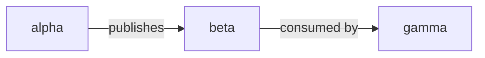

# README Diagram Cosmetic Styling Implementation Plan

> **For agentic workers:** REQUIRED SUB-SKILL: Use superpowers:subagent-driven-development (recommended) or superpowers:executing-plans to implement this plan task-by-task. Steps use checkbox (`- [ ]`) syntax for tracking.

**Goal:** Add brand-palette color styling (translucent zone tints, datastore honey fills, role node-tints) to the five generated README Mermaid diagrams, color-only, with no change to layout or topology.

**Architecture:** A new `scripts/infra_diagrams/style.py` holds the WordSparrow forest/honey palette (ADR-0043) and three emission primitives (`node_classdefs`, `assign`, `zone`) plus a `flat_node_styles` helper and a `GROUP_ROLE` map. Each `render_*` function in `render.py` appends `classDef` / `class` / `style` lines built from those primitives, mapping its own nodes and subgroups to roles. `make diagrams` regenerates `README.md`; the `readme-diagrams-drift` CI gate enforces freshness.

**Tech Stack:** Python 3 (stdlib + PyYAML), pytest, Mermaid flowchart `classDef`/`class`/`style` directives, GNU make.

**Workspace:** worktree `/Users/isho/IdeaProjects/bliss/.claude/worktrees/chore+readme-diagram-styling` on branch `chore/readme-diagram-styling`. All commands below run from that directory. The shell cwd may reset between tool calls — prefix commands with `cd <worktree> &&` as needed.

**Spec:** `docs/superpowers/specs/2026-06-11-readme-diagram-styling-design.md`.

---

## Palette reference (single source of truth — Task 1)

| Role        | Zone wash (subgraph `style` fill) | Node fill (`classDef`) | Stroke    |
|-------------|-----------------------------------|------------------------|-----------|
| `context`   | `#6a93581f`                       | `#6a935826`            | `#6a9358` |
| `data`      | — (no zone)                       | `#c8945633`            | `#a87538` |
| `messaging` | `#a875381f`                       | `#a8753826`            | `#c89456` |
| `external`  | `#b8554020`                       | `#b8554022`            | `#b85540` |
| `infra`     | `#5a655a1f`                       | — (no node fill)       | `#8b9488` |

Translucent 8-digit hex (last two digits = alpha) so the wash adapts to GitHub light/dark. `rgba()` is forbidden — its commas break Mermaid's style-property parser.

## File structure

- **Create** `scripts/infra_diagrams/style.py` — palette + emission primitives. One responsibility: turn `(role, ids)` into Mermaid style strings.
- **Modify** `scripts/infra_diagrams/render.py` — each `render_*` appends its style lines. Per-diagram role mapping lives here (diagram-specific), built on `style.py` primitives.
- **Modify** `scripts/infra_diagrams/test_generate.py` — add unit tests for `style.py`, per-renderer style assertions, and a `build_readme` regression test.
- **Regenerate** `README.md` via `make diagrams` (generated artifact, excluded from the 400-line PR cap).

---

### Task 1: Palette module `style.py`

**Files:**
- Create: `scripts/infra_diagrams/style.py`
- Test: `scripts/infra_diagrams/test_generate.py` (append)

- [ ] **Step 1: Write the failing tests**

Append to `scripts/infra_diagrams/test_generate.py`:

```python
import style


def test_node_classdefs_emit_in_fixed_order() -> None:
    assert style.node_classdefs({"data", "context"}) == [
        "  classDef context fill:#6a935826,stroke:#6a9358;",
        "  classDef data fill:#c8945633,stroke:#a87538;",
    ]


def test_node_classdefs_skips_roles_without_node_fill() -> None:
    assert style.node_classdefs({"infra"}) == []  # infra has zone fill only


def test_zone_uses_translucent_fill_and_stroke() -> None:
    assert style.zone("Edge", "infra") == "  style Edge fill:#5a655a1f,stroke:#8b9488;"


def test_assign_joins_ids() -> None:
    assert style.assign(["a", "b"], "data") == "  class a,b data;"


def test_flat_node_styles_groups_by_role_deterministically() -> None:
    out = style.flat_node_styles(
        ["grid", "game", "nats"],
        {"grid": "context", "game": "context", "nats": "messaging"},
    )
    assert out == [
        "  classDef context fill:#6a935826,stroke:#6a9358;",
        "  classDef messaging fill:#a8753826,stroke:#c89456;",
        "  class grid,game context;",
        "  class nats messaging;",
    ]


def test_group_role_covers_known_groups() -> None:
    assert style.GROUP_ROLE["Sources"] == "context"
    assert style.GROUP_ROLE["Cloud"] == "external"
    assert style.GROUP_ROLE["Edge"] == "infra"
```

- [ ] **Step 2: Run the tests to verify they fail**

Run: `cd /Users/isho/IdeaProjects/bliss/.claude/worktrees/chore+readme-diagram-styling && python3 -m pytest scripts/infra_diagrams/test_generate.py -k "style or classdefs or zone or assign or flat or group_role" -q`
Expected: FAIL with `ModuleNotFoundError: No module named 'style'`.

- [ ] **Step 3: Write the module**

Create `scripts/infra_diagrams/style.py`:

```python
from __future__ import annotations

# WordSparrow forest/honey palette (ADR-0043, frontend/panda.config.ts).
# Zone/node fills are translucent 8-digit hex so the wash adapts to GitHub
# light and dark; strokes are opaque mid-tones legible on both. rgba() is
# avoided — its commas break Mermaid's style-property parser.
_ROLES: dict[str, dict[str, str | None]] = {
    "context":   {"zone": "#6a93581f", "node": "#6a935826", "stroke": "#6a9358"},
    "data":      {"zone": None,        "node": "#c8945633", "stroke": "#a87538"},
    "messaging": {"zone": "#a875381f", "node": "#a8753826", "stroke": "#c89456"},
    "external":  {"zone": "#b8554020", "node": "#b8554022", "stroke": "#b85540"},
    "infra":     {"zone": "#5a655a1f", "node": None,        "stroke": "#8b9488"},
}

# Fixed emission order keeps render output deterministic regardless of input.
_ROLE_ORDER = ("context", "data", "messaging", "external", "infra")

# Subgraph group name -> role (zone tint). Context subgraphs (ctx_*) are
# styled green directly by the cluster renderer, not via this map.
GROUP_ROLE: dict[str, str] = {
    "Edge": "infra",
    "Messaging": "messaging",
    "CI": "infra",
    "Cloud": "external",
    "Sources": "context",
    "Ingest": "infra",
    "Backend": "infra",
    "Analytics": "messaging",
    "Alerting": "external",
}


def node_classdefs(roles: set[str]) -> list[str]:
    return [
        f"  classDef {r} fill:{_ROLES[r]['node']},stroke:{_ROLES[r]['stroke']};"
        for r in _ROLE_ORDER
        if r in roles and _ROLES[r]["node"] is not None
    ]


def assign(node_ids: list[str], role: str) -> str:
    return f"  class {','.join(node_ids)} {role};"


def zone(subgraph_id: str, role: str) -> str:
    spec = _ROLES[role]
    return f"  style {subgraph_id} fill:{spec['zone']},stroke:{spec['stroke']};"


def flat_node_styles(node_ids: list[str], role_by_id: dict[str, str]) -> list[str]:
    """classDef + class lines for a subgraph-less diagram, deterministically.

    node_ids is the diagram's node order; role_by_id maps the tinted ids only.
    """
    present = [
        r for r in _ROLE_ORDER if any(role_by_id.get(n) == r for n in node_ids)
    ]
    lines = node_classdefs(set(present))
    for r in present:
        ids = [n for n in node_ids if role_by_id.get(n) == r]
        lines.append(assign(ids, r))
    return lines
```

- [ ] **Step 4: Run the tests to verify they pass**

Run: `cd /Users/isho/IdeaProjects/bliss/.claude/worktrees/chore+readme-diagram-styling && python3 -m pytest scripts/infra_diagrams/test_generate.py -k "style or classdefs or zone or assign or flat or group_role" -q`
Expected: PASS (6 tests).

- [ ] **Step 5: Commit**

```bash
cd /Users/isho/IdeaProjects/bliss/.claude/worktrees/chore+readme-diagram-styling
git add scripts/infra_diagrams/style.py scripts/infra_diagrams/test_generate.py
git commit -s -m "feat(infra-diagrams): add diagram style palette module"
```

---

### Task 2: Style the cluster diagram

**Files:**
- Modify: `scripts/infra_diagrams/render.py` (`render_cluster`, ends at line 53; add `import style` near top)
- Test: `scripts/infra_diagrams/test_generate.py` (append)

- [ ] **Step 1: Write the failing tests**

Append to `test_generate.py`:

```python
def test_render_cluster_styles_db_and_context_zone() -> None:
    out = render.render_cluster(_topo(), _apps())
    assert "  classDef data fill:#c8945633,stroke:#a87538;" in out
    assert "  class gridDB data;" in out
    assert "  style ctx_grid fill:#6a93581f,stroke:#6a9358;" in out
    assert "  style Edge fill:#5a655a1f,stroke:#8b9488;" in out


def test_render_cluster_external_node_gets_terracotta() -> None:
    out = render.render_cluster(
        _topo(
            cluster_external=[{"id": "cluepipeline", "label": "clue AI (local)"}],
            cluster_edges=[
                {"from": "grid", "to": "cluepipeline", "label": "x", "style": "dashed"}
            ],
        ),
        _apps(),
    )
    assert "  classDef external fill:#b8554022,stroke:#b85540;" in out
    assert "  class cluepipeline external;" in out
```

- [ ] **Step 2: Run to verify failure**

Run: `cd /Users/isho/IdeaProjects/bliss/.claude/worktrees/chore+readme-diagram-styling && python3 -m pytest scripts/infra_diagrams/test_generate.py -k "cluster_styles or cluster_external_node" -q`
Expected: FAIL (assertions on missing `classDef`/`style` lines).

- [ ] **Step 3: Implement**

In `scripts/infra_diagrams/render.py`, add the import after the existing imports (top of file, after `from descriptor import Topology`):

```python
import style
```

Replace the tail of `render_cluster` (current lines 49–53):

```python
    for ext in topo.cluster_external:
        lines.append(f'  {_safe(ext["id"])}["{_label(ext["label"])}"]')
    for e in topo.cluster_edges:
        lines.append(f"  {_edge(e)}")
    return "\n".join(lines)
```

with:

```python
    for ext in topo.cluster_external:
        lines.append(f'  {_safe(ext["id"])}["{_label(ext["label"])}"]')
    for e in topo.cluster_edges:
        lines.append(f"  {_edge(e)}")

    roles: set[str] = set()
    assigns: list[str] = []
    db_ids = [
        f"{_safe(s['id'])}DB"
        for s in topo.services
        if s["id"] in contexts and db.get(s["id"])
    ]
    if db_ids:
        roles.add("data")
        assigns.append(style.assign(db_ids, "data"))
    ext_ids = [_safe(x["id"]) for x in topo.cluster_external]
    if ext_ids:
        roles.add("external")
        assigns.append(style.assign(ext_ids, "external"))

    zones = [
        style.zone(group, style.GROUP_ROLE[group])
        for group in shared
        if group in style.GROUP_ROLE
    ]
    zones += [
        style.zone(f"ctx_{_safe(s['id'])}", "context")
        for s in topo.services
        if s["id"] in contexts
    ]

    lines.extend(style.node_classdefs(roles))
    lines.extend(assigns)
    lines.extend(zones)
    return "\n".join(lines)
```

- [ ] **Step 4: Run to verify pass**

Run: `cd /Users/isho/IdeaProjects/bliss/.claude/worktrees/chore+readme-diagram-styling && python3 -m pytest scripts/infra_diagrams/test_generate.py -k cluster -q`
Expected: PASS (existing cluster tests + the 2 new ones).

- [ ] **Step 5: Commit**

```bash
cd /Users/isho/IdeaProjects/bliss/.claude/worktrees/chore+readme-diagram-styling
git add scripts/infra_diagrams/render.py scripts/infra_diagrams/test_generate.py
git commit -s -m "feat(infra-diagrams): style cluster diagram by role"
```

---

### Task 3: Style the cloud diagram

**Files:**
- Modify: `scripts/infra_diagrams/render.py` (`render_cloud`, ends at line 81)
- Test: `scripts/infra_diagrams/test_generate.py` (append)

- [ ] **Step 1: Write the failing test**

```python
def test_render_cloud_zones_ci_and_cloud() -> None:
    out = render.render_cloud(_topo())
    assert "  style Cloud fill:#b8554020,stroke:#b85540;" in out
    assert "  style CI fill:#5a655a1f,stroke:#8b9488;" in out
```

- [ ] **Step 2: Run to verify failure**

Run: `cd /Users/isho/IdeaProjects/bliss/.claude/worktrees/chore+readme-diagram-styling && python3 -m pytest scripts/infra_diagrams/test_generate.py -k cloud_zones -q`
Expected: FAIL.

- [ ] **Step 3: Implement**

Replace the tail of `render_cloud` (current lines 79–81):

```python
    for e in topo.deploy_edges:
        lines.append(f"  {_edge(e)}")
    return "\n".join(lines)
```

with:

```python
    for e in topo.deploy_edges:
        lines.append(f"  {_edge(e)}")
    if workflows:
        lines.append(style.zone("CI", "infra"))
    lines.append(style.zone("Cloud", "external"))
    return "\n".join(lines)
```

- [ ] **Step 4: Run to verify pass**

Run: `cd /Users/isho/IdeaProjects/bliss/.claude/worktrees/chore+readme-diagram-styling && python3 -m pytest scripts/infra_diagrams/test_generate.py -k cloud -q`
Expected: PASS.

- [ ] **Step 5: Commit**

```bash
cd /Users/isho/IdeaProjects/bliss/.claude/worktrees/chore+readme-diagram-styling
git add scripts/infra_diagrams/render.py scripts/infra_diagrams/test_generate.py
git commit -s -m "feat(infra-diagrams): tint cloud diagram zones"
```

---

### Task 4: Style the flow diagram (flat — node tints)

**Files:**
- Modify: `scripts/infra_diagrams/render.py` (`render_flow`, ends at line 100; add a module constant)
- Test: `scripts/infra_diagrams/test_generate.py` (append)

- [ ] **Step 1: Write the failing test**

```python
def test_render_flow_role_tints() -> None:
    out = render.render_flow(_topo(flow_edges=[
        {"from": "ingress", "to": "grid"},
        {"from": "grid", "to": "nats", "label": "PuzzleReady event"},
        {"from": "nats", "to": "game", "label": "consumed by"},
    ]))
    assert "  classDef context fill:#6a935826,stroke:#6a9358;" in out
    assert "  class grid,game context;" in out
    assert "  class nats messaging;" in out
```

- [ ] **Step 2: Run to verify failure**

Run: `cd /Users/isho/IdeaProjects/bliss/.claude/worktrees/chore+readme-diagram-styling && python3 -m pytest scripts/infra_diagrams/test_generate.py -k flow_role -q`
Expected: FAIL.

- [ ] **Step 3: Implement**

Add a module constant just above `def render_flow` in `render.py`:

```python
# Subgraph-less diagram: bounded-context APIs read green, the bus amber.
_FLOW_ROLE = {"grid": "context", "game": "context", "nats": "messaging"}
```

Replace the tail of `render_flow` (current lines 98–100):

```python
    for e in topo.flow_edges:
        lines.append(f"  {_edge(e)}")
    return "\n".join(lines)
```

with:

```python
    for e in topo.flow_edges:
        lines.append(f"  {_edge(e)}")
    ordered = [_safe(n) for n in nodes]
    role_by_id = {_safe(n): _FLOW_ROLE[n] for n in nodes if n in _FLOW_ROLE}
    lines.extend(style.flat_node_styles(ordered, role_by_id))
    return "\n".join(lines)
```

- [ ] **Step 4: Run to verify pass**

Run: `cd /Users/isho/IdeaProjects/bliss/.claude/worktrees/chore+readme-diagram-styling && python3 -m pytest scripts/infra_diagrams/test_generate.py -k flow -q`
Expected: PASS.

- [ ] **Step 5: Commit**

```bash
cd /Users/isho/IdeaProjects/bliss/.claude/worktrees/chore+readme-diagram-styling
git add scripts/infra_diagrams/render.py scripts/infra_diagrams/test_generate.py
git commit -s -m "feat(infra-diagrams): role-tint flow diagram nodes"
```

---

### Task 5: Style the observability diagram

**Files:**
- Modify: `scripts/infra_diagrams/render.py` (`render_observability`, ends at line 117; add a module constant)
- Test: `scripts/infra_diagrams/test_generate.py` (append)

- [ ] **Step 1: Write the failing test**

```python
def test_render_observability_zones_and_clickhouse_data() -> None:
    obs = {
        "nodes": _OBS["nodes"]
        + [{"id": "clickhouse", "label": "ClickHouse", "group": "Backend"}],
        "edges": _OBS["edges"],
    }
    out = render.render_observability(_topo(observability=obs))
    assert "  style Sources fill:#6a93581f,stroke:#6a9358;" in out
    assert "  style Backend fill:#5a655a1f,stroke:#8b9488;" in out
    assert "  classDef data fill:#c8945633,stroke:#a87538;" in out
    assert "  class clickhouse data;" in out
```

- [ ] **Step 2: Run to verify failure**

Run: `cd /Users/isho/IdeaProjects/bliss/.claude/worktrees/chore+readme-diagram-styling && python3 -m pytest scripts/infra_diagrams/test_generate.py -k observability_zones -q`
Expected: FAIL.

- [ ] **Step 3: Implement**

Add a module constant just above `def render_observability`:

```python
# Datastores in the observability backend that read as honey "data".
_OBS_DATA_NODES = {"clickhouse"}
```

Replace the tail of `render_observability` (current lines 115–117):

```python
    for e in edges:
        lines.append(f"  {_edge(e)}")
    return "\n".join(lines)
```

with:

```python
    for e in edges:
        lines.append(f"  {_edge(e)}")
    data_ids = [_safe(n["id"]) for n in nodes if n["id"] in _OBS_DATA_NODES]
    if data_ids:
        lines.extend(style.node_classdefs({"data"}))
        lines.append(style.assign(data_ids, "data"))
    for group in groups:
        if group in style.GROUP_ROLE:
            lines.append(style.zone(group, style.GROUP_ROLE[group]))
    return "\n".join(lines)
```

- [ ] **Step 4: Run to verify pass**

Run: `cd /Users/isho/IdeaProjects/bliss/.claude/worktrees/chore+readme-diagram-styling && python3 -m pytest scripts/infra_diagrams/test_generate.py -k observability -q`
Expected: PASS.

- [ ] **Step 5: Commit**

```bash
cd /Users/isho/IdeaProjects/bliss/.claude/worktrees/chore+readme-diagram-styling
git add scripts/infra_diagrams/render.py scripts/infra_diagrams/test_generate.py
git commit -s -m "feat(infra-diagrams): style observability zones and datastore"
```

---

### Task 6: Style the clue-pipeline diagram (flat — node tints)

**Files:**
- Modify: `scripts/infra_diagrams/render.py` (`render_clue`, ends at line 128; add a module constant)
- Test: `scripts/infra_diagrams/test_generate.py` (append)

- [ ] **Step 1: Write the failing test**

```python
def test_render_clue_role_tints() -> None:
    out = render.render_clue(_topo(clue_pipeline={
        "nodes": [
            {"id": "gen", "label": "G"}, {"id": "sft", "label": "S"},
            {"id": "human", "label": "H"}, {"id": "grid", "label": "C"},
        ],
        "edges": [],
    }))
    assert "  class gen,sft context;" in out
    assert "  class human messaging;" in out
    assert "  class grid data;" in out
```

- [ ] **Step 2: Run to verify failure**

Run: `cd /Users/isho/IdeaProjects/bliss/.claude/worktrees/chore+readme-diagram-styling && python3 -m pytest scripts/infra_diagrams/test_generate.py -k clue_role -q`
Expected: FAIL.

- [ ] **Step 3: Implement**

Add a module constant just above `def render_clue`:

```python
# Subgraph-less loop: model stages green, human-in-loop amber, corpus honey.
_CLUE_ROLE = {"gen": "context", "sft": "context", "human": "messaging", "grid": "data"}
```

Replace the tail of `render_clue` (current lines 126–128):

```python
    for e in edges:
        lines.append(f"  {_edge(e)}")
    return "\n".join(lines)
```

with:

```python
    for e in edges:
        lines.append(f"  {_edge(e)}")
    ordered = [_safe(n["id"]) for n in nodes]
    role_by_id = {
        _safe(n["id"]): _CLUE_ROLE[n["id"]] for n in nodes if n["id"] in _CLUE_ROLE
    }
    lines.extend(style.flat_node_styles(ordered, role_by_id))
    return "\n".join(lines)
```

- [ ] **Step 4: Run to verify pass**

Run: `cd /Users/isho/IdeaProjects/bliss/.claude/worktrees/chore+readme-diagram-styling && python3 -m pytest scripts/infra_diagrams/test_generate.py -k clue -q`
Expected: PASS.

- [ ] **Step 5: Commit**

```bash
cd /Users/isho/IdeaProjects/bliss/.claude/worktrees/chore+readme-diagram-styling
git add scripts/infra_diagrams/render.py scripts/infra_diagrams/test_generate.py
git commit -s -m "feat(infra-diagrams): role-tint clue pipeline nodes"
```

---

### Task 7: Regression guard, regenerate README, verify drift gate

**Files:**
- Modify: `scripts/infra_diagrams/test_generate.py` (append regression test)
- Regenerate: `README.md`

- [ ] **Step 1: Write the failing regression test**

```python
def test_build_readme_emits_styling() -> None:
    skeleton = "\n".join(
        f"<!-- INFRA-DIAGRAM:{m} START -->\n<!-- INFRA-DIAGRAM:{m} END -->"
        for m in readme_mod.MARKER_IDS
    ) + "\n"
    out = generate.build_readme(skeleton)
    assert "classDef data fill:#c8945633,stroke:#a87538;" in out
    assert "style ctx_grid fill:#6a93581f,stroke:#6a9358;" in out
    assert "style Cloud fill:#b8554020,stroke:#b85540;" in out
```

- [ ] **Step 2: Run the full suite (this test passes; it guards real topology output)**

Run: `cd /Users/isho/IdeaProjects/bliss/.claude/worktrees/chore+readme-diagram-styling && python3 -m pytest scripts/infra_diagrams/ -q`
Expected: PASS (all tests, including the new regression test — the real `topology.yaml` has `grid`, `Cloud`, etc., so the styling is present).

- [ ] **Step 3: Regenerate the README diagrams**

Run: `cd /Users/isho/IdeaProjects/bliss/.claude/worktrees/chore+readme-diagram-styling && make diagrams`
Expected: `README infra diagrams regenerated.`

- [ ] **Step 4: Verify the drift gate is green**

Run: `cd /Users/isho/IdeaProjects/bliss/.claude/worktrees/chore+readme-diagram-styling && python3 scripts/infra_diagrams/generate.py --check`
Expected: `README infra diagrams up to date.`

- [ ] **Step 5: Eyeball the diff**

Run: `cd /Users/isho/IdeaProjects/bliss/.claude/worktrees/chore+readme-diagram-styling && git --no-pager diff --stat README.md`
Expected: only `README.md` changed; the diff is added `classDef`/`class`/`style` lines inside the five `INFRA-DIAGRAM` blocks, no edge or node-label changes.

- [ ] **Step 6: Commit**

```bash
cd /Users/isho/IdeaProjects/bliss/.claude/worktrees/chore+readme-diagram-styling
git add scripts/infra_diagrams/test_generate.py README.md
git commit -s -m "chore(infra-diagrams): regenerate styled README diagrams"
```

---

### Task 8 (GATED — verify on GitHub first): rounded label boxes

The rounded label boxes need injected CSS (`themeCSS` via a `%%{init}%%` directive). GitHub renders Mermaid at a stricter `securityLevel` that likely strips it. **Do not implement the renderer change until the probe confirms it renders on GitHub.** If it does not render, abandon this task — the tints from Tasks 1–7 are the complete, shippable result and the spec already accepts default square label boxes.

- [ ] **Step 1: Build a one-diagram probe**

Create a scratch file `docs/infra/_label-probe.md` (temporary, deleted in Step 4) containing exactly:

````markdown

````

- [ ] **Step 2: Push the probe and open it on GitHub**

```bash
cd /Users/isho/IdeaProjects/bliss/.claude/worktrees/chore+readme-diagram-styling
git add docs/infra/_label-probe.md
git commit -s -m "chore(infra-diagrams): temp label-rounding probe"
git push -u origin chore/readme-diagram-styling
```

Then open `docs/infra/_label-probe.md` on GitHub (Files view), in **both** light and dark mode.

- [ ] **Step 3: DECISION — does the label have padding + rounded corners on GitHub?**

  - **If YES** (rounding renders): proceed to Step 4a.
  - **If NO** (square, tight — themeCSS stripped): proceed to Step 4b. This is the expected outcome.

- [ ] **Step 4a (only if rounding renders): wire themeCSS into every diagram**

In `scripts/infra_diagrams/render.py`, add a module constant near the top:

```python
_LABEL_CSS = (
    ".edgeLabel .label span.edgeLabel, .edgeLabel .label > span "
    "{ display:inline-block; padding:3px 8px; border-radius:6px; } "
    ".edgeLabel p { background-color:transparent; margin:0; }"
)
_INIT = '%%{init: {"themeCSS": "' + _LABEL_CSS + '"} }%%'
```

Change each `render_*` first line from `lines = ["flowchart LR"]` (and `render_cloud`/others identically) to prepend the init directive:

```python
    lines = [_INIT, "flowchart LR"]
```

Update the per-renderer tests that assert `out.startswith("flowchart LR")` to assert `out.startswith(_INIT)` and `"flowchart LR" in out` instead. Remove the probe file, regenerate, verify drift, commit:

```bash
cd /Users/isho/IdeaProjects/bliss/.claude/worktrees/chore+readme-diagram-styling
git rm docs/infra/_label-probe.md
make diagrams
python3 scripts/infra_diagrams/generate.py --check
python3 -m pytest scripts/infra_diagrams/ -q
git add -A
git commit -s -m "feat(infra-diagrams): round diagram edge-label boxes"
```

- [ ] **Step 4b (expected — rounding stripped): abandon and clean up**

```bash
cd /Users/isho/IdeaProjects/bliss/.claude/worktrees/chore+readme-diagram-styling
git rm docs/infra/_label-probe.md
git commit -s -m "chore(infra-diagrams): drop label-rounding probe (themeCSS stripped by GitHub)"
```

Then edit `docs/superpowers/specs/2026-06-11-readme-diagram-styling-design.md`: change the "Conditional (verify first)" bullet to record that the GitHub probe confirmed `themeCSS` is stripped, so label rounding is **not shipped** and default boxes stand. Commit:

```bash
cd /Users/isho/IdeaProjects/bliss/.claude/worktrees/chore+readme-diagram-styling
git add docs/superpowers/specs/2026-06-11-readme-diagram-styling-design.md
git commit -s -m "docs(infra-diagrams): record label-rounding probe result"
```

---

## Self-Review (completed during planning)

- **Spec coverage:** Zone tints (Tasks 2,3,5), datastore honey (Tasks 2,5), role node-tints on flat diagrams (Tasks 4,6), per-diagram assignments match the spec table; translucent-fill / no-`rgba()` constraint encoded in `style.py` (Task 1); portability two-tier handled (Tasks 1–7 portable, Task 8 gated); regression guard (Task 7); out-of-scope crossing/ELK untouched. No gaps.
- **Placeholder scan:** every code/test step contains complete code and exact commands; no TBD/TODO.
- **Type consistency:** primitives `node_classdefs(set)`, `assign(list, role)`, `zone(id, role)`, `flat_node_styles(list, dict)`, and `GROUP_ROLE` are used with matching signatures across Tasks 2–7. Renderer-local constants `_FLOW_ROLE`, `_OBS_DATA_NODES`, `_CLUE_ROLE` are defined in the task that first uses them.
- **Determinism:** all emission iterates `topo`/`nodes` order or the fixed `_ROLE_ORDER`; `test_render_is_deterministic` continues to hold.
